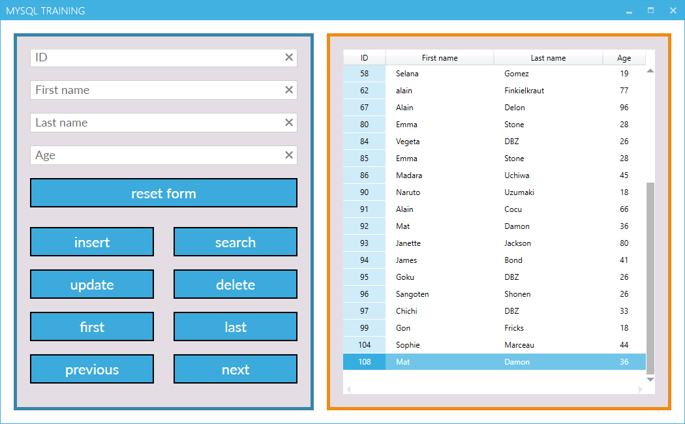

# MySQLBasics
A C#/.NET/WPF/MVVM/MySQL project with a modern design UI and basic database commands

This step by step tutorial aims to guide you to launch properly the project by taking in account the difference between the original local database of this project and your local database.

1) Install (if not already) a MySQL server => https://dev.mysql.com/downloads/mysql/#downloads

2) Install (if not already) Visual Studio => https://visualstudio.microsoft.com/fr/downloads/

3) Clone or download this repository => 'MySQLBasics' 

4) Click and open the 'MySQL.sln' file

5) Change the 'Global.cs' file at line 9 base on your local database login information  

6) Rebuild the solution 

7) Create a 'test' database on your MySQL server 

8) Inside this 'test' database import the 'Classe' table located at this path '.../MySQLBasics-master/Resources/classe_table.sql'. 
   Find help on 'importing a table' on this thread discussion => https://stackoverflow.com/questions/6682916/how-to-take-backup-of-a-single-table-in-a-mysql-database 
      
9) Launch the application by:
   - Clicking on the 'MySQL.exe' file located at this path '.../MySQLBasics-master/MySQL/bin/Debug' 
   - Opening (if not already) the 'MySQL.sln' file and then by clicking on the running button
   
10) Bravo, now enjoy my dear geek !

The below screenshot corresponds to what your are going to see at application launch. Nice isn't it :)

